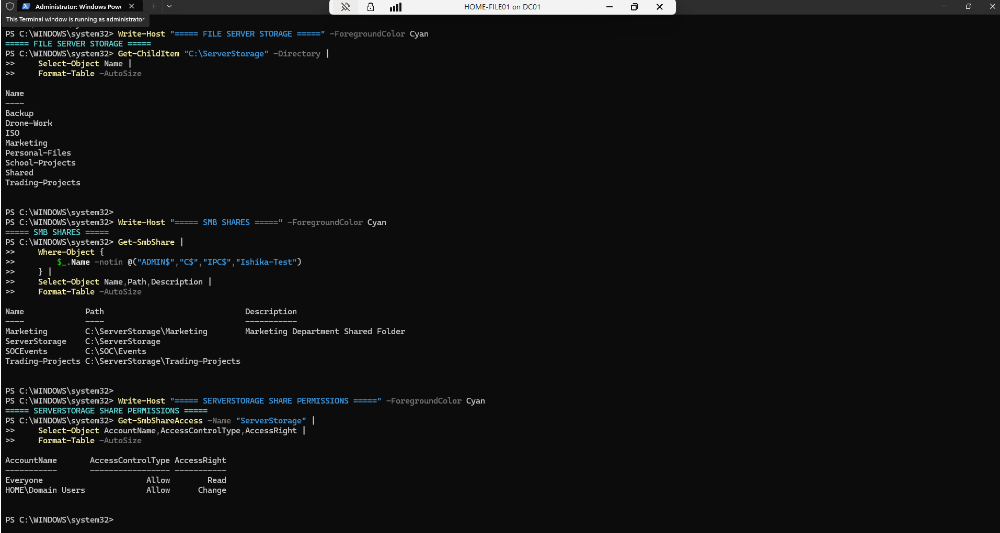

# Windows File Server & SMB Administration Lab

## Project Overview

This project demonstrates the configuration and administration of a Windows file server integrated with an Active Directory domain.

The lab provides hands-on experience with centralized file storage, SMB network shares, NTFS permissions, Active Directory security groups, network drive access, Group Policy integration, PowerShell administration, and Windows file-server troubleshooting.

All configurations were performed in an authorized personal home-lab environment.

> Internal IP addresses, personal user names, credentials, and other sensitive information are intentionally excluded from this public documentation.

---

## Environment

| System | Role |
| --- | --- |
| HOME-DC01 | Active Directory Domain Services and DNS |
| HOME-FILE01 | Windows File Server / SMB |
| HOME-TEST01 | Domain-joined Windows test system |
| HOME.LOCAL | Active Directory domain |

The file server is integrated with the HOME.LOCAL Active Directory environment.

---

## Centralized Storage

Centralized storage was configured on HOME-FILE01 under:

`C:\ServerStorage`

The verified storage structure contains directories for:

- Backup
- Drone work
- ISO storage
- Marketing
- Personal files
- School projects
- Shared resources
- Trading projects

This structure separates resources according to their purpose and access requirements.

---

## SMB File Sharing

Windows Server Message Block (SMB) was used to make selected resources available across the network.

Verified project shares include:

| Share | Purpose |
| --- | --- |
| ServerStorage | Centralized storage |
| Marketing | Departmental file access |
| Trading-Projects | Project-specific storage |
| SOCEvents | Security-event collection and monitoring |

Standard Windows administrative shares and personal test shares are excluded from the public project documentation.

---

## SMB Share Permissions

Share-level permissions were configured to control network access.

The verified `ServerStorage` share permissions include:

| Account | Permission |
| --- | --- |
| Everyone | Read |
| HOME\Domain Users | Change |

This configuration demonstrates differentiated access between general read access and authenticated domain-user change access.

---

## NTFS Permissions

NTFS Access Control Lists are used alongside SMB share permissions.

The lab includes examples of:

- Full Control
- Modify
- Read & Execute
- Explicit Deny

Administrative identities such as SYSTEM and local Administrators retain Full Control where appropriate.

Domain identities and Active Directory security groups are assigned permissions according to the resource being accessed.

Personal account information is intentionally excluded from this public documentation.

---

## SMB and NTFS Effective Access

Windows network file access can be affected by two permission layers:

1. SMB share permissions
2. NTFS filesystem permissions

When a user accesses a resource over the network, both permission layers must be considered.

This lab was used to examine and validate the relationship between SMB share permissions and NTFS permissions.

---

## Active Directory Integration

The Windows file server is integrated with the HOME.LOCAL Active Directory domain.

Active Directory security groups are used within the file-server permission model.

A dedicated Marketing security group is included in the NTFS permission structure for the Marketing directory.

The access-control relationship can be represented as:

`Active Directory Identity → Security Group → SMB Share → NTFS ACL → File/Folder Access`

This approach demonstrates centralized access management using domain identities and security groups.

---

## Group Policy Drive Mapping

HOME-FILE01 is integrated with Active Directory Group Policy drive mapping.

A custom Drive Mapping Policy configured on the domain controller maps selected file-server resources to Windows drive letters.

Configured project resources include storage for:

- Trading projects
- Drone work
- Personal files
- School projects

This demonstrates centralized delivery of file-server resources to domain users through Group Policy.

---

## SOC Integration

HOME-FILE01 also provides an SMB resource used by the Home Lab SOC environment.

The `SOCEvents` share supports security-event collection and monitoring between Windows systems and the security-monitoring environment.

Read-only access is used where appropriate for the monitoring workflow.

This connects the Windows infrastructure environment with the separate Home Lab SOC / Security Monitoring project.

---

## PowerShell Administration

PowerShell was used to inspect and verify the Windows file-server configuration.

Administrative tasks included:

- Enumerating storage directories
- Listing SMB shares
- Inspecting SMB share properties
- Reviewing SMB permissions
- Inspecting NTFS ACLs
- Comparing SMB and NTFS permissions
- Validating Active Directory integration
- Troubleshooting network file access

Example PowerShell cmdlets used include:

`Get-ChildItem`

`Get-SmbShare`

`Get-SmbShareAccess`

`Get-Acl`

These commands provide administrators with a repeatable method for inspecting and troubleshooting Windows file services.

---

## Security Considerations

The lab demonstrates several Windows file-server security concepts:

- Separation of SMB and NTFS permissions
- Active Directory authentication
- Security-group-based access control
- Read versus Modify access
- Explicit Deny permissions
- Administrative Full Control
- Least-privilege concepts
- Separation of departmental and project storage

This is a training environment. Individual lab settings should not automatically be interpreted as production security recommendations.

---

## Troubleshooting and Verification

The environment was tested and verified using Windows Server administration tools and PowerShell.

Verification included:

- Confirming storage directories
- Confirming SMB shares
- Reviewing share paths
- Reviewing share permissions
- Reviewing NTFS ACLs
- Confirming domain integration
- Confirming Group Policy drive mappings
- Testing network access
- Troubleshooting file-access issues

This provides practical experience with both configuration and operational support of Windows file services.

---

## Skills Demonstrated

- Windows Server administration
- Windows file-server configuration
- SMB administration
- NTFS permissions
- Access Control Lists
- Active Directory integration
- Active Directory security groups
- Network shares
- Group Policy drive mapping
- PowerShell administration
- File-access troubleshooting
- Infrastructure testing
- Security monitoring integration
- Access-control administration
- Technical documentation

---

## Evidence

### Windows File Server and SMB Configuration

The following evidence demonstrates the configured centralized storage directories, SMB network shares, and ServerStorage share permissions.

The evidence verifies:

- Centralized `ServerStorage` directory structure
- Marketing SMB share
- ServerStorage SMB share
- SOCEvents SMB share
- Trading-Projects SMB share
- Read access for general network users
- Change access for authenticated domain users

Personal identities, credentials, and unnecessary sensitive information are excluded from the public evidence.

---

## Related Portfolio Projects

This project integrates with other projects in the portfolio, including:

- Windows Server & Active Directory
- Home Lab SOC / Security Monitoring
- Managed IT Support & Service Desk
- PowerShell Automation
- Networking Infrastructure

Together, these projects demonstrate practical experience across Windows infrastructure, networking, technical support, automation, and cybersecurity.

---

## Project Status

**Status: Completed Lab Project**

The Windows File Server & SMB environment has been configured, tested, documented, and integrated with the larger HOME.LOCAL infrastructure and cybersecurity home lab.
