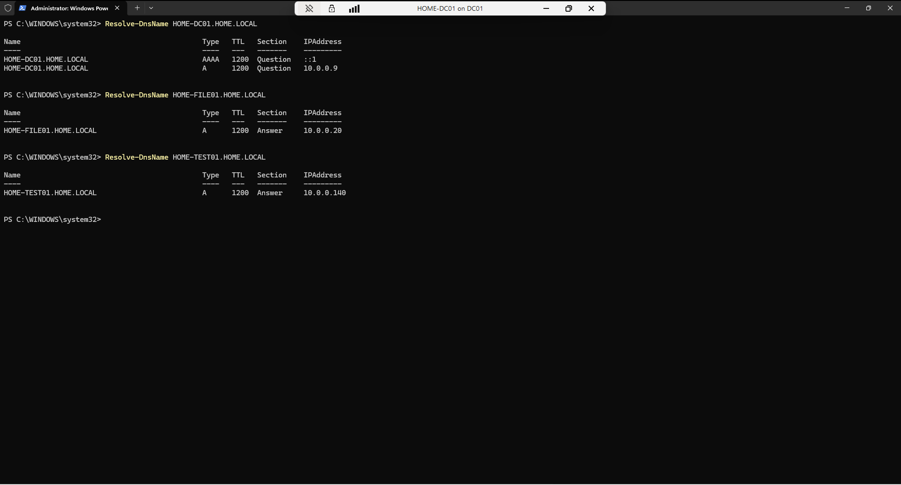
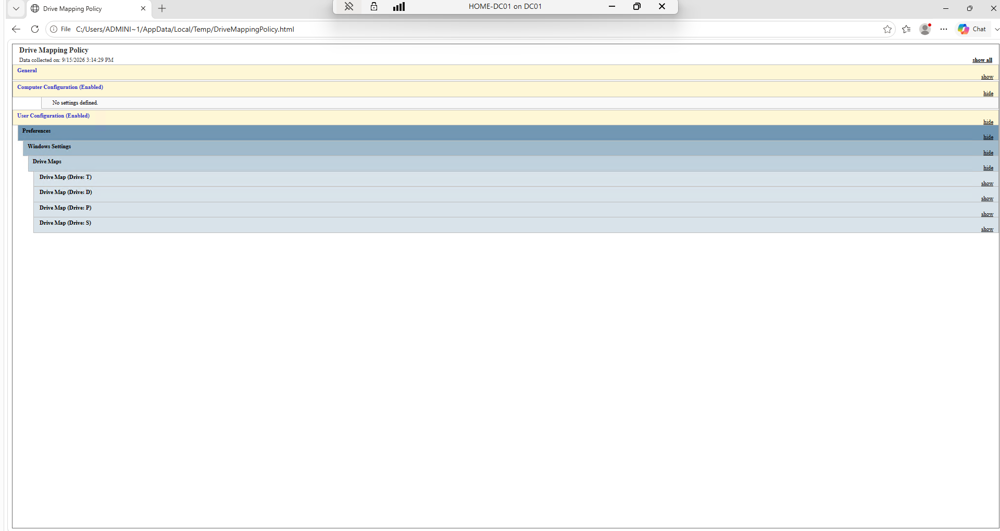
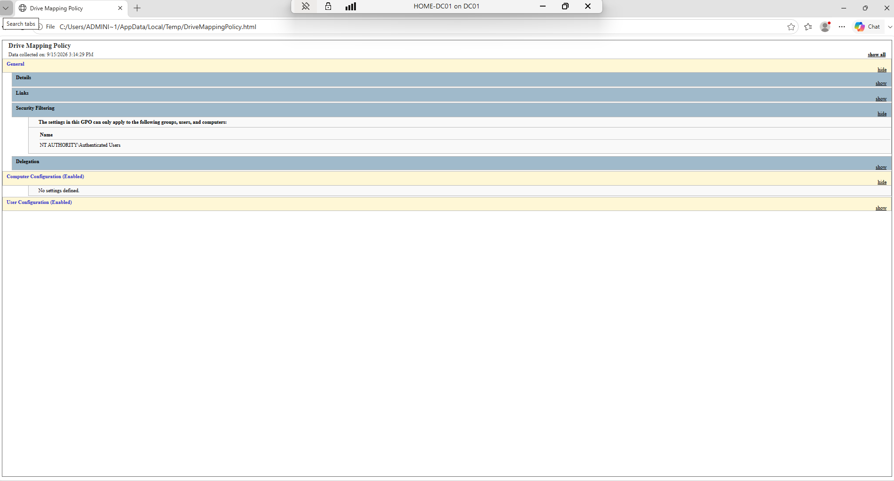

# Windows Server & Active Directory Home Lab

## Project Overview

This project documents the deployment and administration of a Windows Server Active Directory environment in my personal home lab.

The environment was built to develop practical experience with Windows Server administration, Active Directory Domain Services, DNS, Group Policy, security groups, domain-joined systems, SMB file services, and access control.

All systems in this project are part of an authorized personal lab environment.

> Internal IP addresses and personal account information are intentionally omitted or sanitized in this public documentation.

---

## Lab Architecture

The Active Directory environment uses the following core systems:

| System | Role |
| --- | --- |
| HOME-DC01 | Domain Controller, Active Directory Domain Services and DNS |
| HOME-FILE01 | Windows File Server and SMB storage |
| HOME-TEST01 | Domain-joined Windows test system |
| Kali Linux | Security monitoring and administrative testing |

### Active Directory Domain

- Domain: `HOME.LOCAL`
- NetBIOS name: `HOME`
- Domain mode: Windows Server 2025
- Primary domain controller: `HOME-DC01`

---

## Active Directory Domain Services

Active Directory Domain Services was deployed on `HOME-DC01`.

The environment includes custom Organizational Units for separating systems, users, groups, servers, service accounts, and departmental resources.

Examples include:

- Computers
- Groups
- Home Users
- Marketing
- Servers
- Service Accounts
- Users

Active Directory administration performed in the lab includes:

- Domain deployment
- User account creation
- Security group creation
- Organizational Unit management
- Group membership administration
- Domain computer management
- Password policy configuration
- Domain authentication testing

---

## Security Groups

Several custom Global Security groups were created to practice role-based access management.

Examples include groups for:

- IT administration
- Marketing users
- Personal file access
- School project access
- Trading project access
- Drone project access

The `Marketing-Users` group was verified as a Global Security group and is used in the file-server permission structure.

Some lab groups intentionally have no current members while access-control configurations are being tested.

---

## DNS Configuration

DNS is hosted on `HOME-DC01` and integrated with Active Directory.

The primary Active Directory DNS zones include:

- `HOME.LOCAL`
- `_msdcs.HOME.LOCAL`

DNS A records were verified for the primary lab systems.

Name-resolution testing successfully resolved:

- `HOME-DC01.HOME.LOCAL`
- `HOME-FILE01.HOME.LOCAL`
- `HOME-TEST01.HOME.LOCAL`

This verifies that DNS-based hostname resolution is functioning within the domain environment.

### DNS Evidence

---

## Group Policy

Group Policy Management is used to centrally configure domain systems and users.

The lab contains the standard domain policies as well as a custom:

`Drive Mapping Policy`

The policy is enabled and linked to the `HOME.LOCAL` domain.

It uses Group Policy Preferences to configure network drive mappings for file-server resources.

Configured drive mappings include resources for:

- Trading projects
- Drone work
- Personal files
- School projects

This demonstrates centralized configuration of network resources through Active Directory Group Policy.

### Group Policy Evidence

---

## Windows File Server Integration

`HOME-FILE01` provides centralized storage using Windows SMB file sharing.

The server contains a structured storage environment for:

- Backups
- Drone work
- ISO files
- Marketing
- Personal files
- School projects
- Shared resources
- Trading projects

Verified SMB shares include:

- `ServerStorage`
- `Marketing`
- `Trading-Projects`
- `SOCEvents`

Administrative Windows shares are not included as portfolio project shares.

---

## SMB and NTFS Permissions

The lab uses both SMB share permissions and NTFS filesystem permissions.

The `ServerStorage` SMB share was verified with differentiated access levels for general and domain-user access.

Individual project shares also use different access levels.

NTFS Access Control Lists were configured to provide combinations of:

- Full Control
- Modify
- Read & Execute
- Explicit deny permissions

Security groups are also used in NTFS permissions, including the `Marketing-Users` security group.

This demonstrates the relationship between:

`Active Directory Identity → Security Groups → SMB Permissions → NTFS Permissions`

Personal account names used during testing are intentionally excluded from this public documentation.

---

## Group Policy Drive Mapping

The file server is integrated with Active Directory through Group Policy drive mappings.

The verified Drive Mapping Policy uses network paths hosted by `HOME-FILE01` and assigns drive letters to project storage locations.

This provides users with centrally managed access to network storage after domain authentication.

---

## Password Policy Testing

The HOME.LOCAL domain was used to test Active Directory password-policy configuration.

The lab policy was modified during testing to demonstrate:

- Minimum password length configuration
- Password complexity settings
- Password history
- User password creation and validation

These settings are part of a controlled lab environment and are not presented as production security recommendations.

---

## Skills Demonstrated

This project demonstrates hands-on experience with:

- Windows Server administration
- Active Directory Domain Services
- Domain controller configuration
- DNS administration
- DNS record management
- DNS name-resolution testing
- Organizational Units
- Active Directory users and groups
- Global Security groups
- Group Policy Management
- Group Policy Preferences
- Network drive mapping
- Windows file-server administration
- SMB file sharing
- NTFS permissions
- Access Control Lists
- Domain authentication
- PowerShell administration
- Infrastructure troubleshooting
- Technical documentation

---

## Evidence

Evidence included in this project:

- DNS hostname-resolution testing
- Group Policy drive-map configuration
- Group Policy security filtering

Additional evidence will be added as the lab continues to develop.

---

## Security and Privacy

This repository contains documentation from an authorized personal home lab.

For security and privacy:

- Internal IP addresses are sanitized from public documentation.
- Personal user account names are omitted.
- Passwords and credentials are never published.
- Authentication tokens are never stored in the repository.
- Sensitive infrastructure information is excluded where appropriate.

---

## Project Status

**Status:** Active / Continuing Development

The environment is being expanded as I continue developing practical skills in Windows Server administration, infrastructure, networking, cybersecurity, automation, and IT operations.
